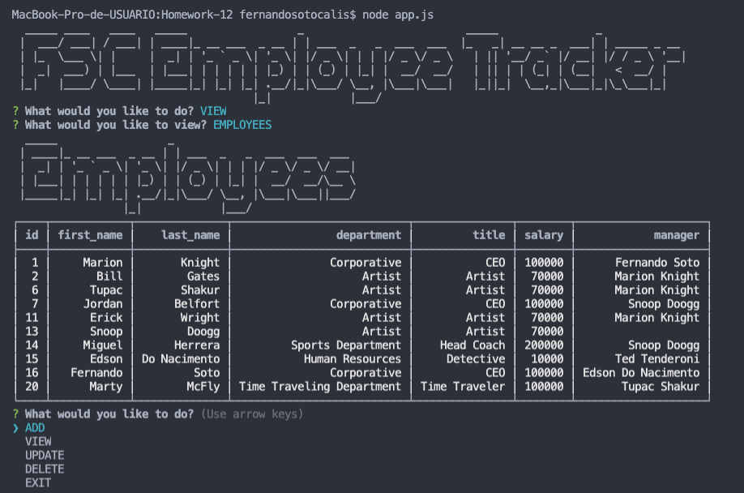

# MySQL Homework: Employee Tracker

# Description 

Developers are often tasked with creating interfaces that make it easy for non-developers to view and interact with information stored in databases. Often these interfaces are known as Content Management Systems. In this homework assignment, the challenge was to architect and build a solution for managing a company's employees using node, inquirer, and MySQL.

Los desarrolladores a menudo tienen la tarea de crear interfaces que faciliten a los no desarrolladores ver e interactuar con la información almacenada en las bases de datos. A menudo, estas interfaces se conocen como sistemas de gestión de contenido. En esta tarea, el desafío era diseñar y construir una solución para administrar a los empleados de una empresa usando node, inquirer y MySQL.

# App working example

   
[Video Link App Working](https://)

# App Screen Shots

   

# Table of contents

- [Description](#Description)
- [App Working Example](#Description)
- [Installation](#Installation)
- [Usage](#Usage)
- [Licence](#Licence)
- [Contributor](#Contributors)
- [Test](#Test)
- [Repository Link](#Repository)
- [GitHub Info](#GitHub) 

# Installation
Run:

                npm i

# Usage

This command-line application allows the user to:

  * Add departments, roles, employees

  * View departments, roles, employees

  * Update employee roles

  * Update employee managers

  * Delete departments, roles, and employees

The application will be invoked with the following command:

                node app.js

# Licence

# Contributors

# Test

[GitHub Test Link](https://cartaya1.github.io/Employee-Tracker/)

# Repository

- [Project Repo](https://github.com/cartaya1/Employee-Tracker)

# GitHub

- Luis Cartaya
- [GitHub Profile](https://github.com/cartaya1)
- [GitHub Email](cartaya1@msn.com)
- Cartaya's House Inc.